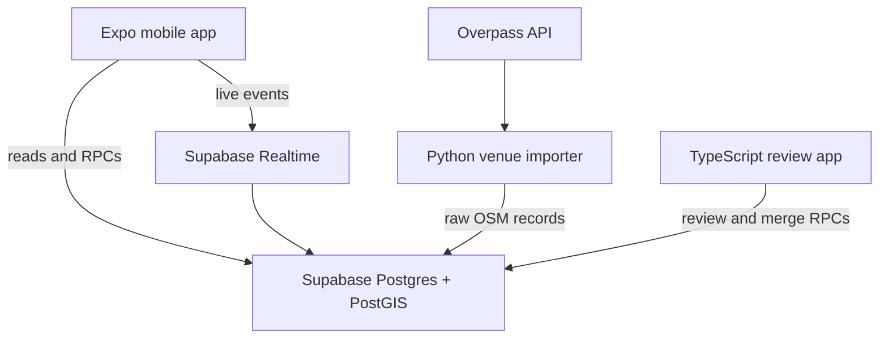

# Architecture

Derived from the project's canonical reference document. Keep a copy at
`docs/reference.md`; where this file and the reference disagree, the reference wins and this file
needs updating.

Product rules live in [product-rules.md](product-rules.md). Decision records are in
[decisions/](decisions/).

---

## System



**Postgres is the source of truth for business rules.** Mobile and admin do not duplicate merge,
dedup, or check-in validation logic. Reads may go directly to Supabase under RLS; writes that
carry validation or touch several tables go through database functions so they are transactional.

The service-role credential never appears in a mobile or browser bundle. `scripts/check-client-bundles.mjs`
enforces this in CI, and it self-tests so a broken check fails loudly rather than passing everything.

Realtime is an **invalidation signal**, not a data channel: on an event, refetch the authoritative
aggregate. Never maintain counts by incrementing local state from events — reconnects drop
messages, and a count that drifts is worse than one that reloads.

---

## Access control

Two independent mechanisms, both required:

- **GRANTs** decide which operations a role may attempt
- **RLS** decides which rows it may touch

Supabase grants default privileges on new `public` tables to `anon` and `authenticated`, so every
migration explicitly revokes first. A table added without RLS is the most likely way this project
would leak data, so a pgTAP test asserts that **no public table lacks RLS**.

`profiles` shows why both matter. Every row is selectable — you need to see other players' names.
But `home_region_id` and `onboarding_completed_at` are private, and RLS is row-level, so it cannot
express "this column, but only for me". A **column-level grant** narrows `anon`/`authenticated` to
`(id, display_name, avatar_path)`, and `current_profile()` gives the owner their own full row.

`is_admin()` is `SECURITY DEFINER` for a load-bearing reason, not out of habit: `admin_users`
denies SELECT to everyone, so a policy calling it as the invoker would see zero rows and every
admin check would silently return false.

There is **no API path that grants admin** — no INSERT policy on `admin_users` for anyone,
including admins. Promotion requires a privileged connection (`npm run db:admin`), which is what
makes escalation auditable.

---

## Venue data lifecycle

```
Overpass API
     │  importer, per region bbox
     ▼
staging  ── raw OSM tags preserved verbatim, nothing trusted
     │  human review: name, classify sport, merge, reject
     ▼
venues   ── published; what the app reads
```

Three concepts keep provenance durable across re-imports:

- **import batches** — one execution against one region
- **source records** — latest raw representation of each external feature
- **venue candidates** — reviewable proposals: approve, reject, or merge into an existing venue

One venue may link to several OSM records (a park with two courts). One OSM record may be
rejected outright. Published venues are never overwritten automatically by source data.

**A venue is a destination a player would recognise and check into** — not one OSM object. Two
facilities are not one venue merely because they are within 40 m.

### Why the alias table has three states

`osm_sport_aliases` maps a normalized OSM token to one of our sports, _or_ records that we
deliberately ignore it. The third state is the absence of a row, meaning **unknown**, which must
surface to a human. Without it, a new OSM tag vanishes silently and nobody learns the data changed.

The token normalization this depends on is not theoretical. Live Overpass data contains
`tennis; basketball` — with a space — alongside `soccer;basketball` and
`seven-a-side;five-a-side;soccer`. A database CHECK constraint rejects any alias that is not a
single lowercased, trimmed token, so a normalization bug fails loudly at write time instead of
quietly losing sports.

### Deduplication

`find_duplicate_candidates()` lives in Postgres rather than in the importer, because user
submissions arrive through the app and would never reach importer-side logic. One definition, one
threshold, both entry points.

Three distances, three jobs:

| Distance | Used for                                                 |
| -------- | -------------------------------------------------------- |
| 150 m    | prevention list shown before a user submits              |
| 100 m    | server-side candidate search on submission               |
| 40 m     | high-confidence review band, calibrated on Charlottetown |

Distance alone never decides. Ranking also uses shared sports, name/alias similarity,
indoor/outdoor agreement, and shared source or address evidence. **No automatic merging, ever** —
adjacent courts may be separate destinations, and only a local can tell.

`merge_venues()` moves references rather than deleting: check-ins already point at the loser row,
so it survives as a pointer (`merged_into_venue_id`) and its name is preserved as an alias.
Merge cycles are rejected. This is why `merged_into_venue_id` exists in the schema from the start —
retrofitting it after check-ins exist means a migration plus a backfill plus touching every read.

---

## Maps and third-party data

OSM data is free; OSM _infrastructure_ is not a production dependency you get for free.

- Community tile servers are capacity-limited, require attribution and identification, and
  prohibit bulk prefetch. Keep the tile URL configurable so it can move providers without a code
  release. See the [tile usage policy](https://operations.osmfoundation.org/policies/tiles/).
- Public Nominatim is not for autocomplete and not for bulk reverse-geocoding.
  See the [Nominatim policy](https://operations.osmfoundation.org/policies/nominatim/).
- Human reviewers provide the initial Charlottetown display names. This is not a fallback — for
  ~90 venues in a city you know, it produces better names than any geocoder would.
- Mobile starts with `react-native-maps` behind a `MapViewAdapter` seam so the provider can change.
- Display OSM attribution wherever venue data appears.

---

## Environments

|                | Purpose                                                 | Notes                                                                                                    |
| -------------- | ------------------------------------------------------- | -------------------------------------------------------------------------------------------------------- |
| **Local**      | Schema iteration                                        | Docker. `db reset` freely — nothing shared to break.                                                     |
| **Hosted dev** | Collaborative venue review, device testing              | Receives reviewed migrations from source control. No production users. Admins bootstrapped explicitly.   |
| **Production** | Created only once the vertical slice and RLS suite pass | No dashboard schema edits. Deploy applies committed migrations, regenerates types, then deploys clients. |

Schema work happens locally because a review pass is collaborative and needs shared data — you
cannot rebuild a database your partner is actively reviewing in.

---

## Build sequence

**Phase 0 — repository and database foundation. Complete.**
Monorepo, local Supabase config, first migrations, seed, generated types, CI, app shells.
_Exit: a new contributor can clone, install, start Supabase, reset, run both apps and all tests
from the README._

**Phase 1 — venue data foundation.**
Batches, source records, candidates, venues, source links, audit. PostGIS indexes and the
duplicate-candidate function. Python import and analyze commands. Admin review queue with
transactional approve/reject/merge RPCs. Charlottetown import; unpublished second-region smoke test.
_Exit: raw OSM becomes a clean reviewed Charlottetown venue list without hand-editing tables._

**Phase 2 — read-only mobile discovery.**
Auth and onboarding, map/list, sport filters, venue detail. Loading, empty, offline and
permission-denied states.
_Exit: a user can find a reviewed venue and see which sports it supports._

**Phase 3 — live check-in vertical slice.**
Location permission, check-in/extend/checkout/expiry RPCs, live counts, region-filtered Realtime
invalidation, RLS and concurrency tests.
_Exit: two devices see a check-in appear and disappear correctly, with no duplicate active
check-ins for one user._

**Phase 4 — scheduled runs.**
Series CRUD, 14-day occurrence query, exceptions, renewal and staleness.
_Exit: DST-safe upcoming runs; expired series vanish without being deleted._

**Phase 5 — user venue submissions.**
Nearby-venue prevention step, submission form, private status view, duplicate flags in review.
_Exit: an untrusted submission never becomes public without an authorized review decision._

---

## Second-region smoke test

Run the importer against one denser region, kept unpublished. It passes when:

- no region-specific constants appear in importer code
- batching and timeout behaviour stay safe on a larger response
- unknown tokens are surfaced
- re-running produces no duplicate source records or candidates
- no review or publication burden is created for that region

Halifax is seeded for this (`is_published = false`): bigger, denser, spans a harbour — different
enough from Charlottetown to actually test the parameterization.
