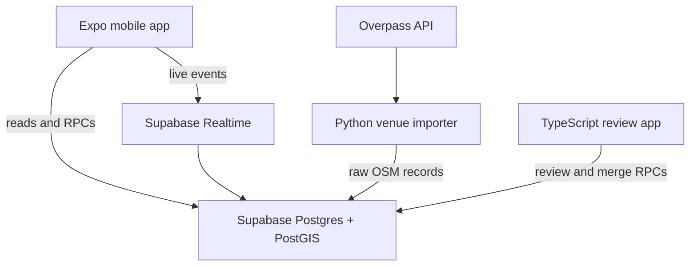

# Drop In — Product Logic and Scaffolding Reference

**Status:** Working architecture baseline
**Initial launch region:** Charlottetown, Prince Edward Island, Canada
**Audience:** Product owners, Codex, Claude Code, and future contributors
**Purpose:** Convert the concept and venue-foundation discussion into one implementation reference with explicit product rules, data boundaries, and build order.

> Canonical source document. [architecture.md](architecture.md) and
> [product-rules.md](product-rules.md) derive from this file; where they disagree, this file wins.
> Originally written as `pickup-sports-app-reference.md`, before the product was named Drop In.

---

## 1. Product in one sentence

A mobile app that shows where pickup sports are active now, lets players broadcast a short-lived on-site check-in, and lists trustworthy recurring runs nearby.

The core loop is:

1. Open the app.
2. See nearby venues and current activity for the sports you play.
3. Open a venue.
4. Check in if physically nearby, or view an upcoming recurring run.
5. The check-in disappears automatically when it expires or the user checks out.

The app is a **presence and discovery tool**, not a chat app or an event-management platform.

---

## 2. Decisions already made

These came from the two source documents and should be treated as locked unless the owners explicitly change them.

| Area                 | Decision                                                                                       |
| -------------------- | ---------------------------------------------------------------------------------------------- |
| Initial market       | Charlottetown and its immediate area                                                           |
| Expansion            | Region-parameterized from day one; prove the importer against a second unpublished region      |
| Mobile               | React Native, Expo, TypeScript                                                                 |
| Backend              | Supabase: Postgres, PostGIS, Auth, Realtime                                                    |
| Venue source         | OpenStreetMap through Overpass, plus moderated user submissions                                |
| Importer             | Python CLI using a small dependency set                                                        |
| Admin/review tooling | TypeScript                                                                                     |
| Database workflow    | Local Supabase for schema work; hosted development project for collaborative review            |
| Import model         | Import into staging, review, then publish; never write raw imports directly into public venues |
| Deduplication        | Shared Postgres functions propose candidates; humans decide merges                             |
| Scale posture        | Build inexpensive expansion seams now; defer scheduled reconciliation and job orchestration    |
| Launch social model  | Public regional discovery filtered by sport; no follow graph or direct messages                |

---

## 3. Corrections and gaps in the earlier logic

### 3.1 "Venue" was not defined

For this app, a **venue is a destination a player would recognize and check into**, not necessarily one OSM object.

- A park containing two adjacent basketball courts may be one venue.
- A sports complex may be one venue with several supported sports.
- Two nearby facilities are not automatically one venue merely because they are within 40 metres.
- One venue may link to several OSM source records.
- One OSM source record may be rejected without creating a venue.

This distinction prevents a pair of hoops or adjacent court polygons from becoming duplicate public pins while preserving the original source data.

### 3.2 Raw imports and public venues need a durable provenance layer

The earlier `venue_imports.venue_id` approach handles the first import but is weak for later re-imports, multiple OSM objects mapping to one venue, and an OSM feature appearing after a user submission.

Use three concepts instead:

1. **Import batches** — one execution against one region.
2. **Source records** — the latest raw representation of each external feature.
3. **Venue candidates** — reviewable proposals that can be approved, rejected, or merged into an existing venue.

Published venues are never overwritten automatically by source data.

### 3.3 User submissions require minimal moderation in v1

The overview included user-submitted venues while also excluding moderation tables. Those two choices conflict. If users can submit venues, the app needs at least an approval queue and duplicate review.

The resolved rule is:

- A submitted venue is immediately visible to its submitter with an **Under review** label.
- It is not visible to other users and cannot host a public check-in until approved.
- The submit flow first shows nearby existing venues to prevent duplicates.
- Full reporting, appeals, reputation scoring, and community moderation remain out of scope.

### 3.4 OSM data does not include production map hosting

OSM data is free, but the community tile servers are capacity-limited, best-effort, require attribution and identification, prohibit bulk prefetching, and may block non-compliant clients. The public Nominatim geocoder also has strict usage and caching limits. The app must therefore keep the map renderer and geocoder replaceable and must not make public OSM infrastructure an invisible production dependency. See the [OSM tile policy](https://operations.osmfoundation.org/policies/tiles/) and [Nominatim policy](https://operations.osmfoundation.org/policies/nominatim/).

### 3.5 Check-in expiry cannot depend only on a cleanup job

An active check-in is defined by the query predicate:

```text
ended_at IS NULL AND expires_at > now()
```

The UI, counts, and database functions must all use that rule. A scheduled cleanup may set `ended_at`, but correctness cannot depend on the cleanup running on time.

### 3.6 Recurring runs can become stale too

Auto-expiry was defined for live check-ins but not for schedules. A weekly run from an inactive organizer can mislead users for months. Every recurring series therefore has a finite `valid_until` date and must be renewed.

---

## 4. MVP scope

### Included

- Email authentication and session persistence
- Profile with display name and selected sports
- Region-aware venue map and list
- Sport filters
- Venue detail with current activity
- Location-gated check-in, checkout, extension, and automatic expiry
- Optional short check-in note and party size
- Weekly recurring runs with a finite renewal date
- OSM import for Charlottetown
- Admin import-review workflow
- User venue submissions with minimal admin approval
- Duplicate prevention, candidate detection, and safe merge behavior
- Realtime refresh of live activity
- Database migrations, seed data, generated TypeScript types, and automated database tests

### Explicitly excluded

- Friends, followers, squads, and personalized social feeds
- Direct messages or venue chat
- Photos, video, highlights, and comments
- Skill ratings and matchmaking
- Tournament brackets
- Push notifications
- Background location tracking
- Public location history
- Automated venue verification thresholds
- Automatic venue merging
- Automatic OSM-to-published-venue reconciliation
- Multi-language support
- Payments

---

## 5. Core product rules

### 5.1 Visibility

- Browsing venues may be allowed before authentication if desired, but checking in, creating a recurring run, or submitting a venue requires authentication.
- Only `active` venues appear in public discovery.
- `pending` venue candidates are visible only to their submitter and admins.
- `merged` venue URLs resolve to the canonical venue.
- `removed` venues do not appear publicly but remain in the database for history and auditability.

### 5.2 Check-ins

- A user can have only one open check-in at a time.
- A check-in belongs to one active venue and one sport supported at that venue.
- `party_size` includes the checked-in user and defaults to 1.
- Default duration: 90 minutes.
- Allowed duration: 30 minutes to 4 hours.
- A user may extend a check-in, but the total active window may not exceed 4 hours without a new location check.
- Checkout is explicit and immediate.
- Active venue count is the sum of `party_size`, not the number of check-in rows.
- Notes are optional, plain text, and limited to 120 characters.
- Expired check-ins are not publicly readable.

### 5.3 Location gating and privacy

- The mobile client requests foreground location only when needed.
- Browsing and scheduled runs work without location permission.
- Broadcasting "I'm here" requires a recent location reading.
- Initial threshold: the reported point must be within 250 metres of the venue and have reported accuracy of 100 metres or better.
- The threshold is a configurable anti-abuse friction control, not proof of identity or perfect physical presence.
- The exact submitted device coordinate is used inside the check-in transaction but is **not retained**. Store only distance to venue, reported accuracy, and the verification result.
- No background tracking is permitted in v1.

### 5.4 Recurring runs

- v1 supports weekly recurring series, not arbitrary recurrence rules.
- A series has a local weekday, local start/end time, IANA timezone, start date, and `valid_until` date.
- `valid_until` may be no more than 12 weeks after creation or renewal.
- Charlottetown defaults to `America/Halifax`.
- Store local recurrence values, not a single UTC time, so daylight-saving transitions remain correct.
- The organizer may edit, cancel, renew, or deactivate the series.
- A small exceptions table records a cancelled or time-shifted occurrence.
- Public queries show only occurrences in a bounded window, initially the next 14 days.

### 5.5 User-submitted venues

Before opening the form, search for active venues within 150 metres and ask: **"Is it one of these?"**

If the user continues:

- Name, pin location, at least one sport, and indoor/outdoor/unknown are required.
- The server calculates nearby duplicate candidates.
- The submission enters `pending` or `possible_duplicate`.
- The submitter sees its status but other users do not.
- An admin may approve as new, approve by merging into an existing venue, request correction later, or reject.

### 5.6 Venue verification

Publication state and verification are different:

- **Status:** active, merged, removed.
- **Verification:** unverified, admin_verified, community_verified.

For v1, a human-reviewed OSM venue or approved user submission may be marked `admin_verified`. Community verification is only a reserved state. Thresholds based on distinct, location-gated check-ins must be designed from real usage data later.

---

## 6. System architecture



Principles:

- Postgres is the source of truth for business rules.
- Mobile and admin clients do not duplicate merge, dedup, or check-in validation logic.
- Reads may use Supabase directly under Row Level Security.
- Important writes use database functions/RPCs so validation and related changes are transactional.
- The service-role credential never appears in a mobile or browser bundle.
- Realtime is an invalidation signal: after a relevant event, refetch the authoritative aggregate.

Supabase supports indexable PostGIS geography points and RPC-based geo queries; its docs also recommend enabling RLS for exposed tables. See [PostGIS geo queries](https://supabase.com/docs/guides/database/extensions/postgis) and [Row Level Security](https://supabase.com/docs/guides/database/postgres/row-level-security).

---

## 7. Repository scaffold

```text
drop-in/
├── apps/
│   ├── mobile/                 # Expo Router + React Native + TypeScript
│   │   ├── app/                # Route files only
│   │   ├── src/
│   │   │   ├── components/
│   │   │   ├── features/
│   │   │   │   ├── auth/
│   │   │   │   ├── checkins/
│   │   │   │   ├── runs/
│   │   │   │   ├── submissions/
│   │   │   │   └── venues/
│   │   │   ├── lib/
│   │   │   ├── providers/
│   │   │   └── theme/
│   │   └── tests/
│   └── admin/                  # Vite + React + TypeScript review app
│       ├── src/
│       │   ├── features/review/
│       │   ├── features/merges/
│       │   └── lib/
│       └── tests/
├── packages/
│   ├── database-types/         # Generated from Supabase; never hand-edited
│   ├── shared/                 # Small cross-app types/constants only
│   └── ui/                     # Optional; create only after real reuse exists
├── tools/
│   └── venue-importer/
│       ├── pyproject.toml
│       ├── src/venue_importer/
│       └── tests/
├── supabase/
│   ├── migrations/
│   ├── seed.sql
│   ├── tests/
│   └── config.toml
├── docs/
│   ├── architecture.md
│   ├── product-rules.md
│   └── decisions/
├── .env.example
├── .nvmrc
├── package.json               # npm workspaces and shared scripts
├── README.md
└── CLAUDE.md                  # Agent/contributor instructions
```

Use Expo Router because it is Expo's recommended file-based router and new routes are automatically deep-linkable. Use the stable Expo SDK available when scaffolding begins and commit the lockfile instead of hard-coding package versions in this reference. See [Expo Router](https://docs.expo.dev/router/introduction/) and the [Expo SDK reference](https://docs.expo.dev/versions/latest/).

### Mobile routes

```text
app/
├── _layout.tsx
├── (auth)/
│   ├── sign-in.tsx
│   └── onboarding.tsx
├── (tabs)/
│   ├── _layout.tsx
│   ├── index.tsx              # Live map/list
│   ├── scheduled.tsx
│   └── profile.tsx
├── venue/[venueId].tsx
├── check-in/[venueId].tsx
├── run/new.tsx
└── venue-submission/new.tsx
```

Route files should assemble feature components; they should not contain SQL-shaped data access or business rules.

---

## 8. Canonical data model

All public identifiers are UUIDs. Lookup tables may use small identity keys. Every mutable table has `created_at` and `updated_at` where useful.

### Identity and preferences

#### `profiles`

- `id uuid primary key references auth.users`
- `display_name text not null`
- `avatar_path text null`
- `home_region_id bigint null`
- `onboarding_completed_at timestamptz null`

#### `profile_sports`

- `profile_id uuid`
- `sport_id bigint`
- Primary key: `(profile_id, sport_id)`

#### `admin_users`

- `user_id uuid primary key`
- `granted_by uuid null`
- `created_at timestamptz`

Clients cannot add themselves to this table. `is_admin()` is a stable helper used by policies and admin RPCs.

### Lookups

#### `regions`

- `id bigint identity primary key`
- `slug text unique not null`
- `name text not null`
- `min_lat`, `min_lon`, `max_lat`, `max_lon`
- `timezone text not null`
- `is_published boolean default false`
- Check constraints validate latitude/longitude ranges and min/max ordering.

The second smoke-test region is inserted with `is_published = false`.

#### `sports`

- `id bigint identity primary key`
- `slug text unique not null`
- `name text not null`
- `is_active boolean default true`

Initial active sports should reflect real local data: basketball, soccer, volleyball, pickleball, tennis, and optionally ice hockey. Do not expose every OSM sport token automatically.

#### `osm_sport_aliases`

- `alias text primary key`
- `sport_id bigint null`
- `is_ignored boolean not null default false`
- Constraint: exactly one of `sport_id` or `is_ignored = true`

An absent alias is **unknown** and must be surfaced during review; it must not silently disappear.

### Venue ingestion and review

#### `venue_import_batches`

- `id uuid primary key`
- `region_id bigint not null`
- `source text = 'osm'`
- `started_at`, `completed_at`
- `status`: running, completed, failed
- `source_query text`
- `records_seen`, `records_created`, `records_updated`, `error_count`
- `error_summary text null`

#### `venue_source_records`

- `id uuid primary key`
- `region_id bigint not null`
- `source text not null`
- `external_type text not null`
- `external_id text not null`
- `raw_payload jsonb not null`
- `location geography(Point, 4326) not null`
- `first_seen_at`, `last_seen_at`
- `last_import_batch_id uuid null`
- `content_hash text not null`
- Unique: `(source, external_type, external_id)`
- GiST index on `location`

Re-imports update source records but do not edit published venues.

#### `venue_candidates`

- `id uuid primary key`
- `region_id bigint not null`
- `source_record_id uuid null`
- `submitted_by uuid null`
- `source`: osm, user
- `proposed_name text null`
- `location geography(Point, 4326) not null`
- `indoor_state`: indoor, outdoor, unknown
- `status`: pending, possible_duplicate, approved, merged, rejected
- `duplicate_of_venue_id uuid null`
- `reviewed_by`, `reviewed_at`, `review_note`
- `published_venue_id uuid null`

Exactly one origin is required: an OSM candidate has `source_record_id`; a user candidate has `submitted_by`.

#### `venue_candidate_sports`

- `candidate_id uuid`
- `sport_id bigint`
- `origin`: mapped, submitted, reviewer
- Primary key: `(candidate_id, sport_id)`

#### `venue_candidate_unmapped_tokens`

- `candidate_id uuid`
- `token text`
- Primary key: `(candidate_id, token)`

#### `venue_candidate_matches`

- `candidate_id uuid`
- `venue_id uuid`
- `distance_m numeric`
- `shared_sport_count integer`
- `score numeric null`
- Primary key: `(candidate_id, venue_id)`

This is cached review evidence. It never performs a merge by itself.

### Published venues

#### `venues`

- `id uuid primary key`
- `region_id bigint not null`
- `name text not null`
- `location geography(Point, 4326) not null`
- `address_text text null`
- `indoor_state`: indoor, outdoor, unknown
- `status`: active, merged, removed
- `verification_state`: unverified, admin_verified, community_verified
- `verified_at`, `verified_by`, `verification_method`
- `merged_into_venue_id uuid null references venues`
- `created_at`, `updated_at`
- GiST index on `location`

Constraints:

- `status = 'merged'` requires `merged_into_venue_id`.
- Other statuses require `merged_into_venue_id is null`.
- A venue cannot merge into itself.
- Merge cycles are rejected by the merge function.

#### `venue_sports`

- `venue_id uuid`
- `sport_id bigint`
- Primary key: `(venue_id, sport_id)`

#### `venue_source_links`

- `venue_id uuid`
- `source_record_id uuid unique`
- `linked_by uuid`
- `linked_at timestamptz`

Several source records may link to one venue.

#### `venue_aliases`

- `id uuid primary key`
- `venue_id uuid`
- `alias text`
- `source text`

Aliases improve search and help users recognize unnamed or differently named facilities.

### Live check-ins

#### `check_ins`

- `id uuid primary key`
- `user_id uuid not null`
- `venue_id uuid not null`
- `region_id bigint not null` — copied and validated by the RPC for efficient Realtime filtering
- `sport_id bigint not null`
- `party_size smallint not null default 1`, constrained to 1–20
- `note text null`, maximum 120 characters
- `started_at timestamptz not null`
- `expires_at timestamptz not null`
- `ended_at timestamptz null`
- `end_reason`: checkout, expired, replaced, admin
- `location_verified boolean not null`
- `distance_to_venue_m numeric null`
- `reported_accuracy_m numeric null`

A partial unique index on `user_id where ended_at is null` prevents two open check-ins. The create RPC first closes the caller's already-expired open row, then inserts the new one in the same transaction.

### Scheduled runs

#### `run_series`

- `id uuid primary key`
- `organizer_id uuid not null`
- `venue_id uuid not null`
- `sport_id bigint not null`
- `weekday smallint` constrained to 0–6
- `local_start_time time not null`
- `local_end_time time not null`
- `timezone text not null`
- `starts_on date not null`
- `valid_until date not null`
- `title text null`
- `description text null`
- `expected_players smallint null`
- `status`: active, inactive, removed

#### `run_exceptions`

- `id uuid primary key`
- `run_series_id uuid not null`
- `occurrence_date date not null`
- `status`: cancelled, rescheduled
- `replacement_start_at`, `replacement_end_at` nullable
- Unique: `(run_series_id, occurrence_date)`

### Audit

#### `admin_actions`

- `id uuid primary key`
- `admin_user_id uuid not null`
- `action_type text not null`
- `target_table text not null`
- `target_id uuid not null`
- `before_data jsonb null`
- `after_data jsonb null`
- `created_at timestamptz`

Review, approval, rejection, removal, verification, and merge functions write audit rows transactionally.

---

## 9. Required database functions

Business-rule functions should set an explicit empty `search_path`, schema-qualify all objects, validate `auth.uid()`, and grant execution only to intended roles.

| Function                                                               | Caller                                      | Responsibility                                                       |
| ---------------------------------------------------------------------- | ------------------------------------------- | -------------------------------------------------------------------- |
| `nearby_venues(lat, lon, radius_m, sport_ids)`                         | public/authenticated                        | Return active canonical venues and live aggregate counts             |
| `venue_details(venue_id)`                                              | public/authenticated                        | Resolve merged IDs and return one public venue payload               |
| `find_duplicate_candidates(location, sport_ids, radius_m, exclude_id)` | importer/admin/authenticated submission RPC | Rank nearby active venues; never merge                               |
| `submit_venue(...)`                                                    | authenticated                               | Validate input, run duplicate detection, create candidate            |
| `review_venue_candidate(...)`                                          | admin                                       | Approve new, merge to existing, or reject transactionally            |
| `merge_venues(loser_id, winner_id, reason)`                            | admin                                       | Move references, preserve alias row, prevent cycles, audit           |
| `create_check_in(...)`                                                 | authenticated                               | Validate venue/sport/duration/location and enforce one open check-in |
| `end_check_in(check_in_id)`                                            | owner/admin                                 | End immediately with a valid reason                                  |
| `extend_check_in(check_in_id, ...)`                                    | owner                                       | Revalidate location and cap duration                                 |
| `upsert_run_series(...)`                                               | authenticated                               | Validate organizer, venue/sport, timezone, and 12-week limit         |
| `upcoming_runs(region_id, sport_ids, from, to)`                        | public/authenticated                        | Materialize weekly occurrences and apply exceptions                  |

### Duplicate ranking

Use separate distances for separate purposes:

- **150 m:** prevention list shown before a user submits.
- **100 m:** default server-side duplicate-candidate search.
- **40 m:** useful initial high-confidence review band for Charlottetown imports.

Distance alone is never enough. Rank candidates using:

- shared sports;
- normalized name or alias similarity;
- indoor/outdoor agreement;
- common linked source or address evidence;
- distance.

Do not auto-merge, even for very close points. Adjacent courts may be separate destinations.

### Merge transaction

`merge_venues` must:

1. Lock winner and loser.
2. Resolve both to canonical IDs.
3. Reject self-merges, cycles, removed targets, and cross-region merges unless explicitly supported later.
4. Move/union venue sports, source links, aliases, active run series, check-ins, and candidate references.
5. Mark the loser `merged` and point it to the winner.
6. Preserve the loser name as an alias when distinct.
7. Write an admin audit record.
8. Commit all changes or none.

---

## 10. Access-control baseline

Enable RLS on every table exposed through the API. RLS and grants are both part of the security model.

| Data                          | Public/authenticated read        | Owner write                       | Admin write            |
| ----------------------------- | -------------------------------- | --------------------------------- | ---------------------- |
| Active regions/sports/venues  | Yes                              | No                                | Yes                    |
| Venue source/import tables    | No                               | No                                | Yes/import service     |
| User venue candidate          | Submitter sees own               | Create own; no direct status edit | Yes through RPC        |
| Active check-in public fields | Authenticated users while active | Only through RPC                  | End/remove through RPC |
| Expired check-in              | Owner only                       | No direct write                   | Restricted             |
| Profile                       | Public display fields only       | Own profile                       | Restricted             |
| Sport preferences             | Owner                            | Own rows                          | Restricted             |
| Run series                    | Active series public             | Organizer through RPC             | Restricted             |
| Admin/audit tables            | No                               | No                                | Admin only             |

Never place the database password or service-role key in `EXPO_PUBLIC_*`, browser code, committed files, or test snapshots. The importer uses a server-side development database credential from an ignored environment file.

Database tests must cover RLS from anonymous, authenticated-owner, authenticated-other-user, and admin perspectives. Supabase's local workflow supports migrations, seeds, generated types, and database tests through the CLI; Docker is required locally. See [Supabase local development](https://supabase.com/docs/guides/local-development) and [database testing](https://supabase.com/docs/guides/database/testing).

---

## 11. Realtime behavior

Use Realtime only for `check_ins` in v1.

- Subscribe by `region_id` while the Live tab is focused.
- On insert/update/delete, invalidate and refetch the affected venue aggregate.
- Do not maintain authoritative counts by incrementing local state from events; reconnects and filtered events can be missed.
- Client timers remove a check-in from the UI at `expires_at` even if no database update event occurs.
- On app foreground or network reconnect, refetch the visible viewport.
- Unsubscribe when the Live tab loses focus.

Supabase Postgres Changes performs authorization work per subscribed user and processes ordered changes with scaling constraints. Region filtering plus refetch-on-event is sufficient for the first market and leaves a clear migration path to Broadcast or server-maintained aggregates later. See [Supabase Postgres Changes](https://supabase.com/docs/guides/realtime/postgres-changes).

---

## 12. Map and venue-data policy

### Mobile map

Start with `react-native-maps` because it works in Expo Go and uses platform-native Google Maps on Android and Apple Maps or Google Maps on iOS. App-store builds require provider configuration, especially for Google Maps. See [Expo's map-view documentation](https://docs.expo.dev/versions/latest/sdk/map-view/).

Rules:

- Wrap map-provider details behind a `MapViewAdapter` component.
- Keep keys in environment/build secrets.
- Render only pins inside the current viewport or cluster them once density requires it.
- Provide an equivalent venue list for accessibility and map failures.
- Display required OSM attribution because venue data comes from OSM.
- Do not use the public OSM tile service for bulk prefetch or offline maps.

### Admin map

A small Leaflet-based review map may use standard OSM tiles only if it follows the tile policy: visible attribution, normal interactive use, caching behavior, and identifiable traffic. Keep the tile URL configurable so it can move to a hosted provider without a code release.

### Geocoding

- Do not use public Nominatim for autocomplete.
- Do not reverse-geocode every imported feature as a recurring job.
- Human reviewers provide the initial Charlottetown display names.
- If one-time reverse geocoding is deliberately enabled later, keep it server-side, single-threaded, cached, identified, and within the current Nominatim policy—or use a provider designed for application traffic.

---

## 13. Import and review lifecycle

### Importer command contract

```text
venue-importer import-region --region charlottetown [--dry-run]
venue-importer analyze-region --region charlottetown
venue-importer import-region --region <second-region> --unpublished
```

### Import behavior

1. Load region bbox from the database.
2. Create an import-batch row.
3. Query configured Overpass endpoints with timeout, retry, backoff, and an identifying user agent.
4. Validate that the response is JSON and contains the expected structure before changing rows.
5. Extract point/centroid and preserve the full source element in `raw_payload`.
6. Split sport tags on semicolons, trim and lowercase tokens, then resolve aliases.
7. Upsert source records by exact external identity.
8. Create a pending candidate only when the source record is neither linked to a venue nor already represented by an unresolved candidate.
9. Run duplicate-candidate detection and cache matches.
10. Complete the batch with metrics. On failure, record the error and leave already-written source rows safe to reprocess.

The importer is idempotent. A dry run performs fetching, normalization, and reporting but no writes.

### Admin review workflow

The review queue supports:

- filters by region, source, status, sport, unknown token, and duplicate likelihood;
- side-by-side raw tags and normalized proposal;
- map view with nearby published venues and candidates;
- edit name, sports, pin, and indoor state;
- approve as a new venue;
- approve into an existing venue;
- reject with a reason;
- bulk handling only for safe mapping decisions, never venue merges.

### Second-region smoke test

Run the same importer against one denser region, but keep that region unpublished. The test passes when:

- no region-specific constants appear in importer code;
- batching and timeout behavior remain safe;
- unknown tokens are surfaced;
- re-running produces no duplicate source records or candidates;
- no review or publication burden is created for the second region.

---

## 14. Client state and error behavior

- Use a server-state query library for caching, invalidation, retry, and loading states.
- Keep authentication/session state in one provider.
- Keep selected sport filters locally and sync them to profile preferences after sign-in.
- Do not create a global state store until state actually spans unrelated features.
- Every mutation must have an explicit pending, success, validation-error, and network-error state.
- Failed check-ins are never shown optimistically as active.
- A stale cached map may remain visible with a "Last updated" indicator during a network failure.
- The app must handle denied location permission without blocking venue browsing.
- Submitted notes and names are plain text; never render them as HTML.

---

## 15. Development environments

### Local

- Supabase runs in Docker through the project-local CLI dependency.
- Migrations are the schema source of truth.
- `seed.sql` contains sports, aliases, Charlottetown, the unpublished smoke-test region, and synthetic venues/check-ins.
- Local email authentication uses the provided test inbox.
- Developers reset freely with migrations and seed data.

### Hosted development

- Used for collaborative venue review and device testing.
- Receives reviewed migrations from source control.
- Contains no production users.
- Admin accounts are explicitly bootstrapped.
- Importer credentials and app publishable values are separate.

### Production

- Created only when the vertical slice and RLS test suite pass.
- No direct dashboard schema edits.
- Deployment applies committed migrations, regenerates database types, then deploys clients.
- Backups, log retention, quotas, map-provider limits, and spending alerts are reviewed before public beta.

---

## 16. Build sequence

### Phase 0 — Repository and database foundation

Deliver:

- monorepo folders and workspace scripts;
- Expo mobile shell and route groups;
- Vite admin shell;
- Python package shell;
- local Supabase config;
- first migrations, seed data, generated TypeScript types;
- CI for formatting, type checking, Python tests, and database tests.

Exit criteria:

- a new contributor can clone, install, start local Supabase, reset/seed it, run both apps, and run all tests from the README.

### Phase 1 — Venue-data foundation

Deliver:

- regions, sports, aliases, batches, source records, candidates, venues, source links, and audit tables;
- PostGIS indexes and duplicate-candidate function;
- Python import and analysis commands;
- admin review queue and transactional approval/rejection/merge RPCs;
- Charlottetown import;
- unpublished second-region smoke test.

Exit criteria:

- the team can turn raw OSM records into a clean, reviewed Charlottetown venue list without editing production tables manually.

### Phase 2 — Read-only mobile discovery

Deliver:

- authentication/onboarding;
- map/list and sport filters;
- nearby venue and venue-detail RPCs;
- loading, empty, offline, and permission-denied states.

Exit criteria:

- a user can find a reviewed venue and understand which sports it supports.

### Phase 3 — Live check-in vertical slice

Deliver:

- location permission flow;
- check-in, extension, checkout, and expiry RPCs;
- venue live counts and active-player display;
- region-filtered Realtime invalidation;
- RLS and concurrency tests.

Exit criteria:

- two devices see a valid check-in appear promptly and disappear on checkout or at expiry, with no duplicate active check-ins for one user.

### Phase 4 — Scheduled runs

Deliver:

- recurring-series CRUD;
- 14-day occurrence query;
- cancellation/reschedule exceptions;
- renewal and automatic staleness behavior.

Exit criteria:

- DST-safe upcoming runs are correct and expired series vanish without deletion.

### Phase 5 — User venue submissions

Deliver:

- nearby-venue prevention step;
- submission form and private status view;
- duplicate flags in admin review;
- approval into new or existing venue.

Exit criteria:

- an untrusted submission never becomes public without an authorized review decision.

---

## 17. Scaffolding acceptance checklist

Codex and Claude should not call the repository "scaffolded" until all of the following are true:

- [x] README contains exact prerequisites and start/test commands.
- [x] `.env.example` names every required variable without secrets.
- [x] Stable Node version is pinned in `.nvmrc` based on the chosen Expo SDK.
- [x] Package lockfile is committed.
- [x] Mobile app launches with auth and tab route placeholders.
- [x] Admin app launches with a protected placeholder route.
- [x] Python importer exposes a working `--help` and tested normalization function.
- [x] Local Supabase starts and resets from committed files.
- [x] PostGIS is enabled by migration.
- [x] Every exposed table has explicit grants and RLS.
- [x] Database types are generated by script, not hand-written.
- [x] Seed data makes the empty UI testable.
- [x] One command runs formatting, linting, type checks, and tests.
- [x] No service credential is reachable from mobile/admin client bundles.
- [x] Architecture and product-rule docs link back to this reference.

---

## 18. Agent implementation rules

When Codex or Claude works from this document:

1. Treat migrations and database tests as the source of truth for business rules.
2. Build one phase at a time; do not scaffold fake implementations for every future feature.
3. Do not invent new entities when an existing table or function already owns the concept.
4. Do not put service-role credentials in either client.
5. Do not allow direct client writes to review status, merges, verification state, or admin roles.
6. Do not implement automatic merging.
7. Do not rely on a cron job to determine whether a check-in or run is publicly active.
8. Do not overwrite human-reviewed venue fields during re-import.
9. Add or update a database test for every RLS or transactional rule changed.
10. Keep generated files clearly marked and reproducible.
11. Record a short architecture decision when deviating from a locked decision in Section 2.
12. Stop and request an owner decision for the remaining product questions below rather than silently choosing.

---

## 19. Decisions still requiring owner confirmation

These do not block Phase 0 or Phase 1 scaffolding, but they must be settled before the named phase begins.

| Decision                     | Recommended default                                                                                       | Needed by                 |
| ---------------------------- | --------------------------------------------------------------------------------------------------------- | ------------------------- |
| ~~App name and identifiers~~ | **Decided: Drop In** (`drop-in`, `dropin://`, `com.dropin.app`)                                           | ~~Store builds~~          |
| Auth method                  | Email one-time code first; social sign-in later                                                           | Phase 2                   |
| Browse without account       | Allow read-only browsing                                                                                  | Phase 2                   |
| Initial public sports        | Basketball, soccer, volleyball, pickleball, tennis                                                        | Charlottetown publication |
| Check-in identity display    | Display name + avatar while active; count remains after hiding identity if privacy setting is added later | Phase 3                   |
| Initial location threshold   | 250 m distance, accuracy ≤100 m                                                                           | Phase 3                   |
| Party-size cap               | 20                                                                                                        | Phase 3                   |
| Recurring-run lifetime       | 12 weeks                                                                                                  | Phase 4                   |
| Production map provider      | Native platform maps initially; keep adapter seam                                                         | Public beta               |
| Public venue correction flow | Admin contact/report form before community editing                                                        | Public beta               |

---

## 20. Definition of MVP success

The MVP has validated the concept when a seeded Charlottetown user can:

1. open the app and find a real nearby venue for a selected sport;
2. trust that duplicate or stale venue pins are uncommon and correctable;
3. see whether players are currently present;
4. check in with low friction while physically nearby;
5. see that presence disappear reliably after checkout or expiry; and
6. discover a current recurring run without joining a social network or chat.

Metrics should initially answer:

- weekly active users;
- users who view a venue and then check in;
- distinct venues with at least one check-in per week;
- percentage of check-ins ended manually versus expired;
- recurring runs viewed and renewed;
- venue submissions prevented as likely duplicates;
- venue-data corrections per active venue.

Do not optimize growth features until this loop is measurably used.

---

## 21. Reference sources

- [Expo Router introduction](https://docs.expo.dev/router/introduction/)
- [Expo SDK reference](https://docs.expo.dev/versions/latest/)
- [Expo `react-native-maps` documentation](https://docs.expo.dev/versions/latest/sdk/map-view/)
- [Expo Location](https://docs.expo.dev/versions/latest/sdk/location/)
- [Supabase local development](https://supabase.com/docs/guides/local-development)
- [Supabase PostGIS geo queries](https://supabase.com/docs/guides/database/extensions/postgis)
- [Supabase Row Level Security](https://supabase.com/docs/guides/database/postgres/row-level-security)
- [Supabase Postgres Changes](https://supabase.com/docs/guides/realtime/postgres-changes)
- [Supabase database testing](https://supabase.com/docs/guides/database/testing)
- [OpenStreetMap tile usage policy](https://operations.osmfoundation.org/policies/tiles/)
- [OpenStreetMap Nominatim usage policy](https://operations.osmfoundation.org/policies/nominatim/)
